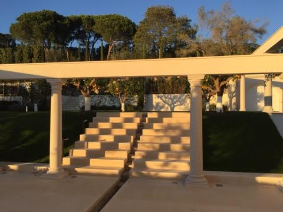
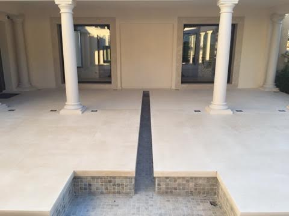
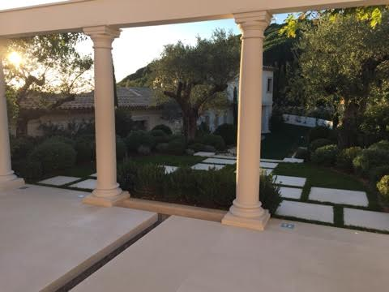
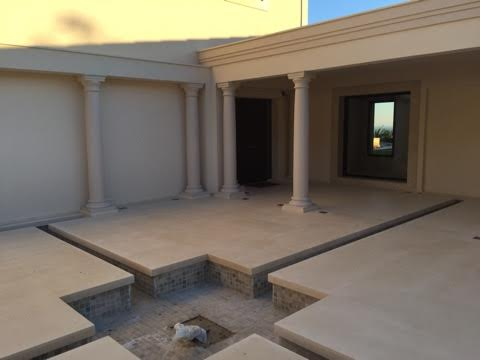
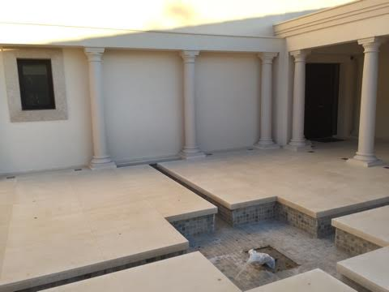
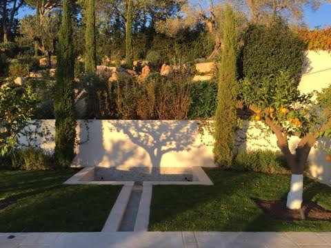

[Images]( index.html )
==

View 1

 

View 2 

_Is the space between the two glass doors(?) a 'niche'?_

 

View 3 

 

View 4

_Is the space at the end of the rill toward the left between two columns a 'niche'?_ 

 

View 5

_Is the space at the end of the upper rill between two columns a 'niche' (same as previous)?_

 

View 6
