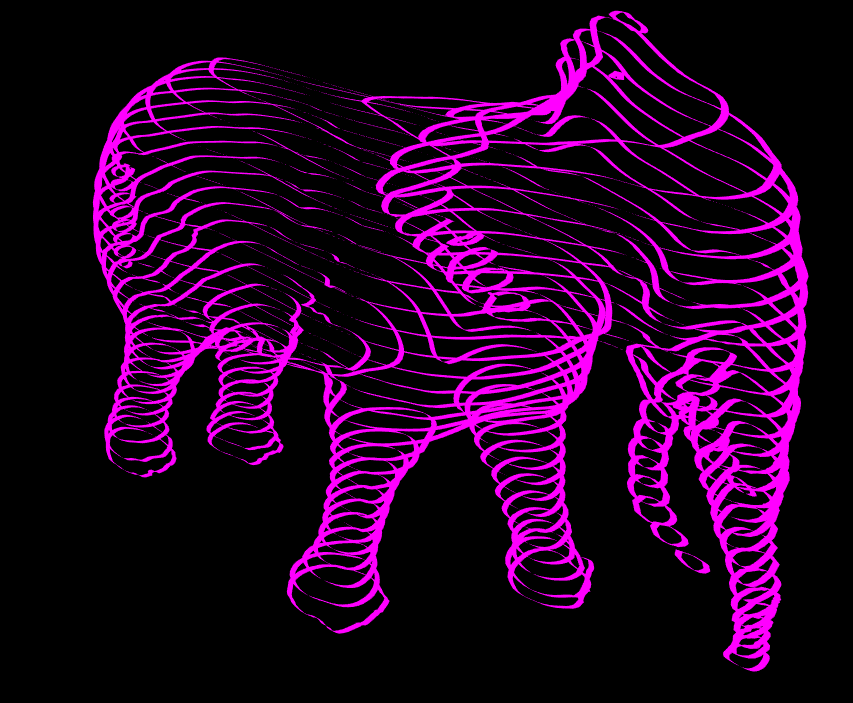

# render csv file

CSV files from https://github.com/dashdotdotdashdotdot/Lines

Canonical link: https://jaanga.github.io/demo/doug-d/render-csv-file/

* link that should always take you to latest version

Read me link: https://github.com/jaanga/jaanga.github.io/tree/master/demo/doug-d/render-csv-file

## Concept

Features

* Browse and open directories of CSV files that are lists of contour line vertices
* Directories may be on line or on a computer
* Display contour lines in interactive 3D
* Provide a number of tools for manipulating and editing the output
* Provide an API with permalinks

### Mission

* Provide an easy way of viewing CSV files of vertices in 3D

### Vision

* Re-appropriate and re-imagine iconic works of art - and familiar objects - in highly accessible, manipulatable ways

## Wishlist

* 2020-01-11 ~ Theo ~ Put models in a resizable room that adjust to phone orientation
* 2019-11-17 ~ Theo ~ save even more useful options in location hash
* 2019-11-17 ~ Theo ~ Add capture mouse or finger interactions - not just text input - to update location hash

## Dev release [render-csv-file-0-09.html]( https://jaanga.github.io/demo/doug-d/render-csv-file/v-0-09/render-csv-file.html )

2020-01-07 v0.09.02

* Adds a "let's dance' button to "Draw mesh lines" panel

## Dev release [render-csv-file-0-08.html]( https://jaanga.github.io/demo/doug-d/render-csv-file/v-0-08/render-csv-file.html )

2019-12-21 v0.08.03

* B: DLM Rejig- Fix issues with normal material
* F: DLM add select front, back or both sides to render

2019-12-12 v0.08.02

* Add basic model statistics

2019-12-05

* F: Add basic lines
* F: Add fat lines
* F: Add mesh lines

All the above have a variety of parameters. But all are still at an early stage. Certain workflows can freeze the browser. So reload often and press the 'Render...' buttons before updating that line type's parameters.

No loction.hash support yet

## Dev release [render-csv-file-0-07.html]( https://jaanga.github.io/demo/doug-d/render-csv-file/v-0-07/render-csv-file.html )

_Work-in-progress, much unfinished_

* R: Code split out into modules
* F: Add gather list of sample files from dashdotdotdashdotdot
* F: Add gather list of sample files from Jaanga

## [render-csv-file-0-06.html]( https://jaanga.github.io/demo/doug-d/render-csv-file/render-csv-file-0-06.html )

* F: Add open file using OS file dialog box
* R: Various fixes and cleanup

## [render-csv-file-0-05.html]( https://jaanga.github.io/demo/doug-d/render-csv-file/v-0-##/render-csv-file-0-05.html )

* Bug: Narrower menu means menu can be toggled on iPhone5
* Feature: Canonical link established
* Feature: URL, start and end lines of CSV now part of the REST API. Menus updated to comply.
	* Done: * 2019-11-17 ~ Theo ~ save csv file url in location hash.

## [render-csv-file-0-04.html]( https://jaanga.github.io/demo/doug-d/render-csv-file/v-0-##/render-csv-file-0-04.html )

* Bug fix: Hide menu on small screens
* Refactor: Y axis is the new 'up'
* Refactor: Rotation is around y axis
* Feature: Add 'reset view' button
* Feature: Add camera x,y,z input
* Feature: Add target x,y,z input
* Feature: Add set camera and target via location.hash

Click menu title to clear location.hash. Edit numbers directly in URL and press enter to update

## [render-csv-file-0-03.html]( https://jaanga.github.io/demo/doug-d/render-csv-file/v-0-##/render-csv-file-0-03.html )

[dashdotdotdashdotdot]( https://www.instagram.com/dashdotdotdashdotdot/) >> [https://www.instagram.com/p/B48SJ7Vnowb/]( https://www.instagram.com/p/B48SJ7Vnowb/ )

* Add helga_half.csv
* Add toggle axes helper checkbox - off by default
* Add select line rendering sides: front, back or both
* Add line width slider

Interaction between all the controls is not well tested - so reload frequently

## [render-csv-file-0-02.html]( https://jaanga.github.io/demo/doug-d/render-csv-file/v-0-##/render-csv-file-0-02.html )

* Refactor from Three.js lines to Three.js meshes
	* Allows for geometry with width and height
	* Allows for single sided materials
	* Will work better with shade and shadow and other features

## [render-csv-file-0-01.html]( https://jaanga.github.io/demo/doug-d/render-csv-file/v-0-##/render-csv-file-0-01.html )

From Doug

> This is great.  to make it a bit more artistic could we make white lines on a black background and maybe a tad thicker?  also if its possible to make the lines transparent that helps too.

## [render-csv-file-0-00.html]( https://jaanga.github.io/demo/doug-d/render-csv-file/render-csv-file-0-00.html )

From Doug

> It works [the OBJ file renderer], but can you work with “line files”.  I think they have a more ”different “ look then the object files.

